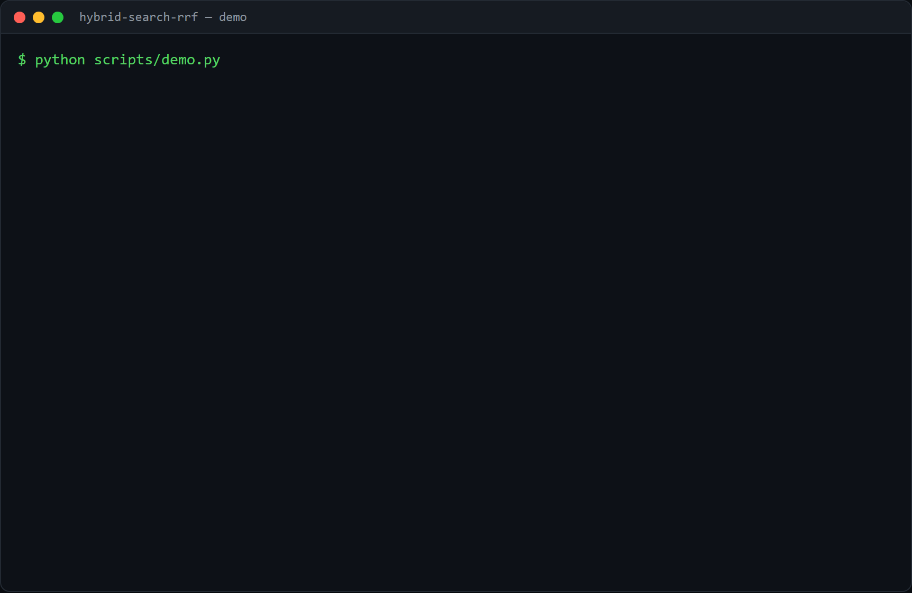

# hybrid-search-rrf

Combine **keyword** (lexical) and **vector** (semantic) search into one ranking
with **Reciprocal Rank Fusion**, the retrieval setup behind most good RAG.

## Demo



The demo (`scripts/demo.py`) runs on five short support-FAQ snippets (returns,
refunds, shipping) and the query *"free returns refund"*. Keyword retrieval is
real Okapi BM25 (`rank-bm25`); the vector half uses OpenAI embeddings when
`OPENAI_API_KEY` is set, otherwise an offline hashing embedder. It prints the
BM25 ranking, the vector ranking, and the Reciprocal Rank Fusion of the two side
by side, so you can see a document that ranks well in both rise to the top, and
`d2` ("send items back at no extra cost"), which shares no query terms, still
surface through the vector retriever.

## Why hybrid

- **Keyword** search (BM25) nails exact terms: product codes, names, error
  strings, numbers. It has no idea about meaning.
- **Vector** search catches paraphrases and synonyms. It often misses an exact
  rare token because the embedding blurs it.

Neither alone is enough. You run both and fuse the two rankings.

## Why RRF

The two retrievers return incomparable scores (a BM25 score vs a cosine), so you
cannot just add them. **Reciprocal Rank Fusion** ignores the scores and uses only
each item's rank:

```
score(doc) = sum over retrievers of  1 / (k + rank)
```

A document ranked well by both rises to the top, and a document found by only one
still makes the list. No score calibration, one tunable constant (`k`, default 60).

## Use it

```python
from hybrid_search import HybridSearch

hs = HybridSearch()
hs.add_many({"d1": "Returns are free within 30 days.", ...})

for hit in hs.search("free returns refund"):
    print(hit.doc_id, hit.found_by, hit.text)   # found_by: ['keyword', 'vector']
```

```bash
pip install -e .
python scripts/demo.py
```

Keyword retrieval is real BM25 out of the box. For the vector half, point it at a
real embedder:

```bash
pip install -e ".[openai]"
cp .env.example .env        # set OPENAI_API_KEY
HS_EMBEDDER=openai python scripts/demo.py
```
```bash
pip install -e ".[semantic]"    # or a local model, no key
HS_EMBEDDER=sentence-transformers python scripts/demo.py
```

With no key and no local model it uses a dependency-free hashing embedder so the
fusion mechanics still run; that embedder is not semantically smart, so use it
only to see the plumbing.

## Tests

```bash
pip install -e ".[dev]"
pytest
```

Covers the RRF math (rewards agreement, keeps single-list items), BM25 keyword
ranking, and that the fused ranking tags each hit with which retriever found it.

## Limitations and next steps

- The hashing embedder shows mechanics only; semantic quality needs
  sentence-transformers or a hosted embedder.
- BM25 is rebuilt per query over the in-memory corpus, which is fine for a demo
  but not for a large index; a real deployment keeps a persistent index.
- Next: per-field boosting, and a reranker (cross-encoder) over the fused top-k.

## License

MIT.
